<div align="center">

# 🛵 Revisión diaria de ciclomotores

**Registro digital de entrada y salida y checklist diario del estado de los ciclomotores de reparto.**

[](https://github.com/Figueira205/Domi-QR/actions/workflows/deploy.yml)


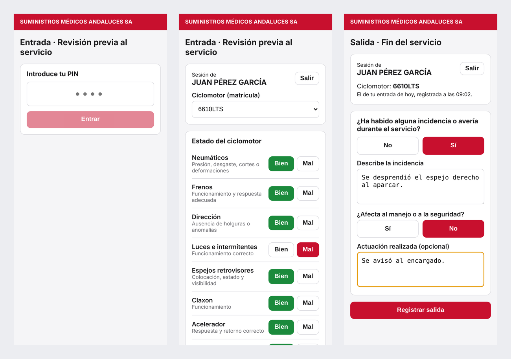

</div>

---

## Índice

- [Objetivo](#objetivo)
- [Cómo funciona](#cómo-funciona)
- [Funcionalidades](#funcionalidades)
- [Reglas de funcionamiento](#reglas-de-funcionamiento)
- [Capturas de pantalla](#capturas-de-pantalla)
- [La hoja mensual en PDF](#la-hoja-mensual-en-pdf)
- [Tecnologías](#tecnologías)
- [Arquitectura](#arquitectura)
- [Estructura del proyecto](#estructura-del-proyecto)
- [Modelo de datos](#modelo-de-datos)
- [Puesta en marcha](#puesta-en-marcha)
- [Despliegue](#despliegue)
- [Configuración](#configuración)
- [Seguridad](#seguridad)
- [Hoja de ruta](#hoja-de-ruta)

## Objetivo

Los repartidores de la tienda tenían que rellenar **a mano** una hoja de papel con la revisión previa de su ciclomotor (neumáticos, frenos, luces…) y firmarla al empezar y al terminar el turno. Eso implica papeles que se pierden, hojas sin rellenar y poca trazabilidad.

Esta aplicación **sustituye el papel por el móvil**:

- El empleado escanea un **código QR**, se identifica con su **PIN** y marca el estado de la moto en menos de un minuto.
- Todo queda guardado en una base de datos, con fecha y hora automáticas.
- El administrador puede consultar los registros y **generar con un clic la hoja mensual en PDF**, con el **mismo formato oficial** que se entregaba en papel, ya rellenada.

> Se basa en el *Protocolo de revisión de ciclomotores de reparto* de la empresa: revisión previa al servicio, registro de incidencias, criterio de actuación y responsabilidades.

## Cómo funciona

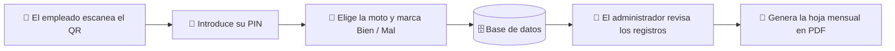

Hay **dos códigos QR**, uno para cada momento del turno:

| QR | Ruta | Qué se registra |
|---|---|---|
| **Entrada** | `/#/entrada` | Revisión previa de los 11 elementos de la moto (Bien / Mal) y, si algo falla, la incidencia y si afecta a la seguridad. |
| **Salida** | `/#/salida` | Fin del servicio y, si la hubo, la incidencia o avería ocurrida durante el reparto. Solo se puede registrar si ese día hay una entrada, y usa la moto de la entrada. |

El administrador entra en `/#/admin` con su contraseña.

## Funcionalidades

**Para los empleados**
- Acceso con **PIN personal de 4 dígitos** (único e intransferible): no hay que escribir el nombre, la aplicación sabe quién es.
- Selección de la **moto** entre las disponibles al registrar la entrada.
- La **salida** solo se puede registrar si ese día ya hay una **entrada**, y se hace automáticamente **con la moto de la entrada**: no hay que volver a elegirla.
- Checklist de 11 elementos con botones grandes **Bien / Mal**, pensado para usarse con una mano.
- Si hay un elemento en mal estado, pide una descripción y avisa de que, si afecta a la seguridad, **no debe usarse la moto** hasta su revisión.
- Si ya registró la entrada (o la salida) de ese día, la aplicación **avisa antes de guardar** y pregunta si quiere sustituirla por la nueva.

**Para el administrador**
- Acceso protegido con contraseña.
- Listado de registros con **filtros** por empleado, tipo (entrada/salida), moto y mes.
- **Hoja mensual en PDF por empleado**, con el formato oficial de la empresa.
- **Gestión de empleados**: crear, modificar y eliminar (nombre completo y PIN, sin PIN repetidos).
- **Alta de registros pasados**, para días en que un empleado olvidó fichar.
- **Modificar y eliminar cualquier registro**, sea quien sea quien lo creó: al tocar un registro aparecen las opciones *Modificar* y *Eliminar*. Antes de borrar se pide confirmación, porque el borrado es **permanente**.

## Reglas de funcionamiento

Pensadas para el día a día real de la tienda:

- **La salida exige una entrada.** Un empleado solo puede registrar la salida si ese día de trabajo ya registró su entrada; si no, la aplicación se lo indica y le lleva a registrarla. La salida se guarda siempre **con la moto de la entrada**. Si la entrada se sustituye por otra con distinta moto, la salida de ese día se actualiza también.
- **Un registro de entrada y uno de salida por empleado y día.** No se pueden crear dos entradas, ni dos salidas, para el mismo día. Vale tanto para los empleados como para el administrador.
- **Aviso antes de sustituir.** Si un empleado intenta registrar una entrada (o salida) cuando ya tiene una ese día, ve un mensaje como *«Ya registraste tu entrada de hoy (a las 09:02). ¿Quieres sustituirla por esta nueva entrada ahora mismo?»*. Si confirma, la anterior se sustituye por la nueva; si cancela, no cambia nada.
- **Turnos de madrugada.** Como el reparto puede terminar pasada la medianoche, **las salidas registradas hasta la 1:30 de la madrugada (hora de Madrid) cuentan para el día anterior**. Así la salida queda en el mismo día de trabajo que su entrada, en el listado y en la hoja PDF. La hora real se conserva y el panel la marca como *«madrugada siguiente»*.
- **El administrador tiene la última palabra.** Puede modificar o eliminar cualquier registro. Si una salida tiene su entrada ese día, su moto queda fijada a la de la entrada. Al modificarlo se aplican las mismas reglas: no puede dejar dos registros del mismo tipo en un día. Eliminar pide confirmación y no se puede deshacer.

## Capturas de pantalla

> Las capturas usan **datos de ejemplo ficticios**.

### Aplicación del empleado (móvil)

<table>
  <tr>
    <td align="center"><b>Acceso con PIN</b></td>
    <td align="center"><b>Entrada</b></td>
    <td align="center"><b>Salida</b></td>
  </tr>
  <tr>
    <td>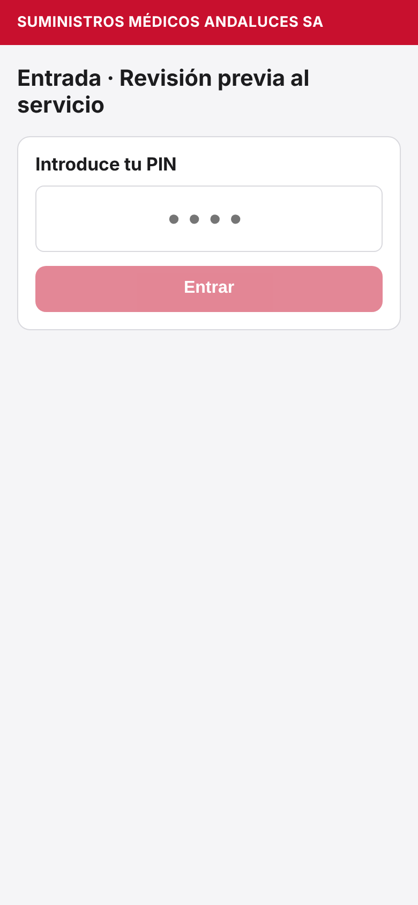</td>
    <td>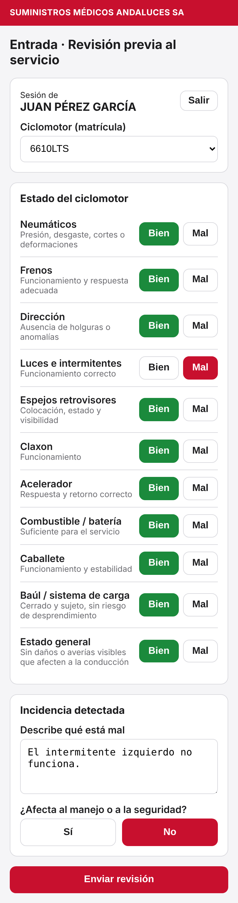</td>
    <td>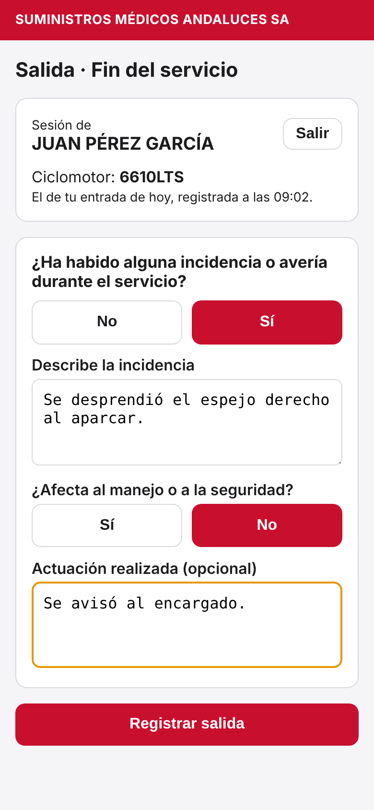</td>
  </tr>
</table>

### Aviso al intentar registrar dos veces el mismo día

<p align="center">
  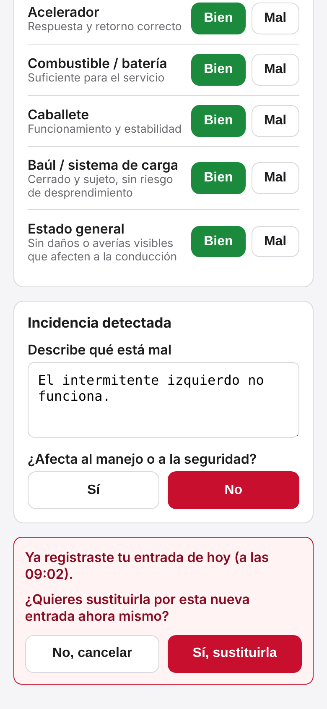
</p>

### Salida sin haber registrado la entrada

<p align="center">
  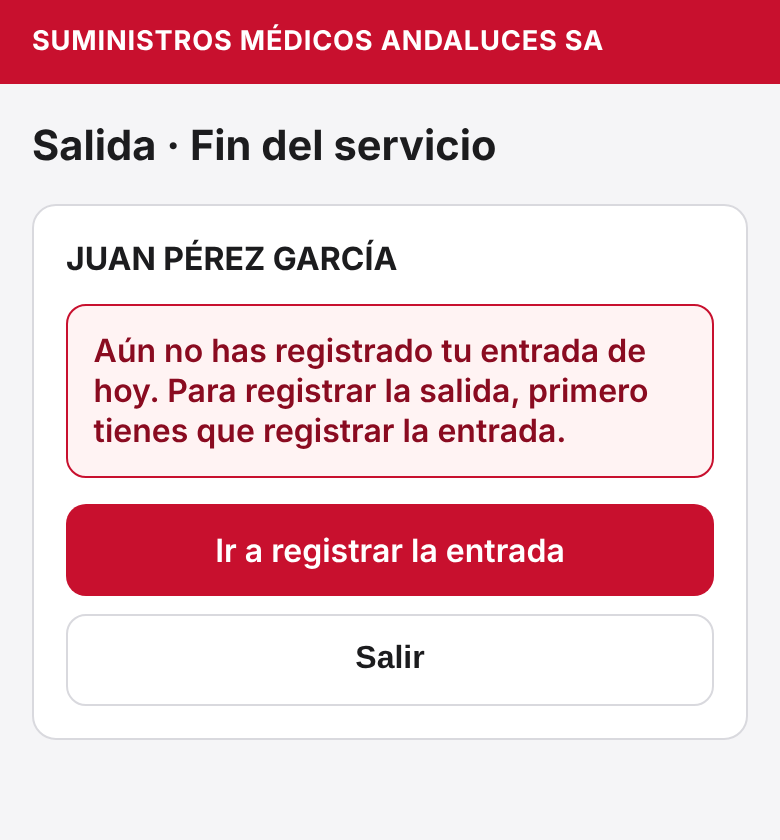
</p>

### Panel de administración

<table>
  <tr>
    <td align="center"><b>Registros y generación del PDF</b></td>
    <td align="center"><b>Gestión de empleados</b></td>
  </tr>
  <tr>
    <td>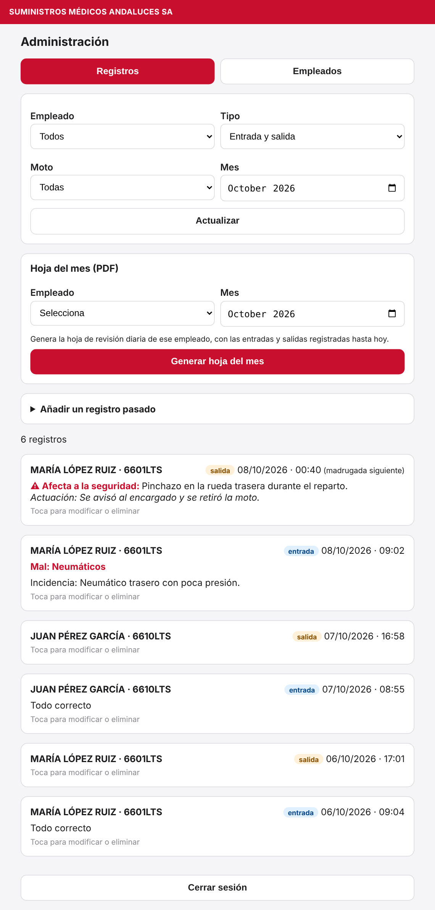</td>
    <td>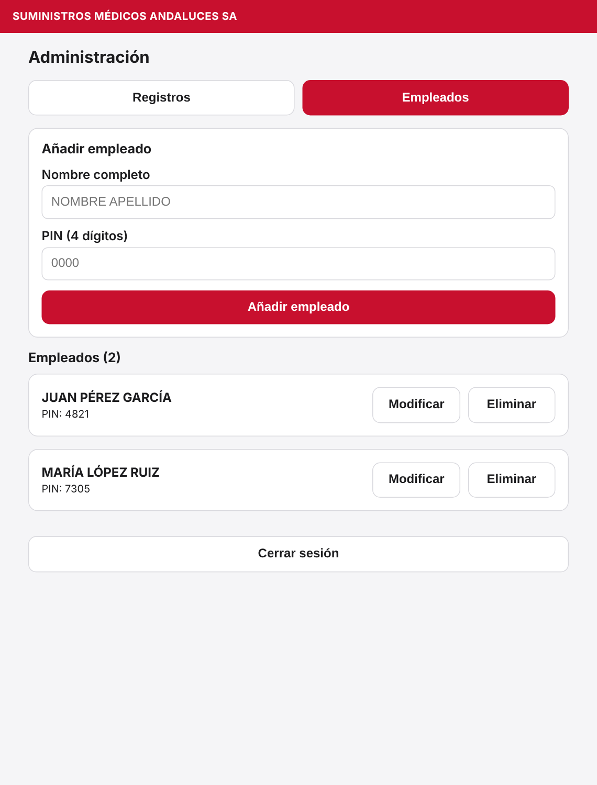</td>
  </tr>
</table>

<table>
  <tr>
    <td align="center"><b>Al tocar un registro: Modificar / Eliminar</b></td>
    <td align="center"><b>Modificar un registro</b></td>
  </tr>
  <tr>
    <td valign="top">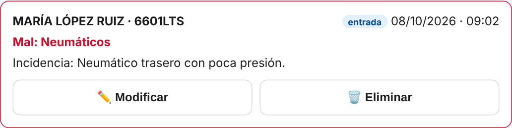</td>
    <td valign="top">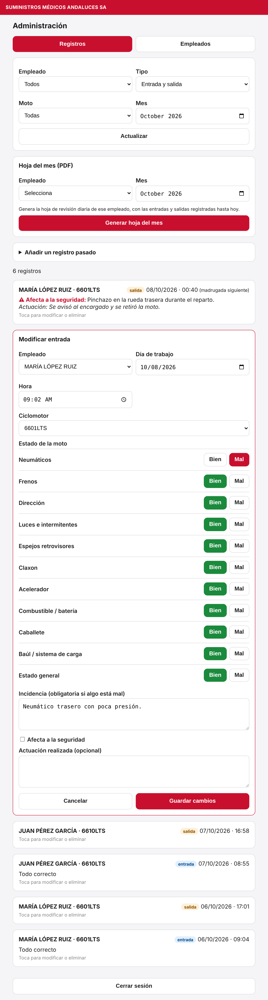</td>
  </tr>
</table>

## La hoja mensual en PDF

Al elegir un **empleado** y un **mes**, se genera una hoja A4 con el formato oficial de la empresa:

- Una fila por día (1–31) y una columna por elemento revisado, con **✓** (Bien) o **✗** (Mal).
- Columnas de **Firma 1 (al inicio del turno)** y **Firma 2 (al final del turno)** con el nombre del empleado los días en que registró la entrada o la salida. Los días sin registro quedan en blanco.
- La **matrícula** de la moto aparece sobre la primera firma (la del primer registro del mes).

<p align="center">
  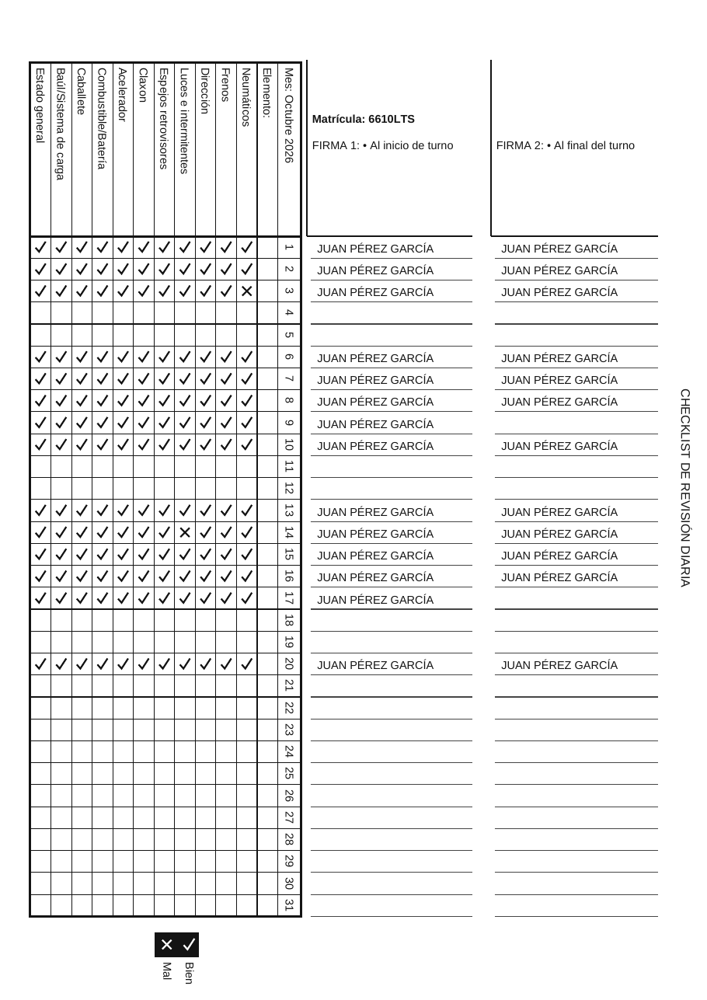
</p>

📄 [Ver el PDF de ejemplo](docs/ejemplo-hoja-mensual.pdf) (datos ficticios).

## Tecnologías

| Capa | Tecnología |
|---|---|
| Interfaz | [Vue 3](https://vuejs.org/) (Composition API) + [Vue Router](https://router.vuejs.org/) en modo *hash* |
| Compilación | [Vite](https://vitejs.dev/) |
| Base de datos y autenticación | [Supabase](https://supabase.com/) (PostgreSQL, *Row Level Security*, Auth, funciones RPC) |
| Generación de PDF | [jsPDF](https://github.com/parallax/jsPDF), dibujado directamente en el navegador |
| Alojamiento | [GitHub Pages](https://pages.github.com/) |
| Integración y despliegue | GitHub Actions |

Es una **aplicación de una sola página sin servidor propio**: todo el código se ejecuta en el navegador y los datos viven en Supabase.

## Arquitectura

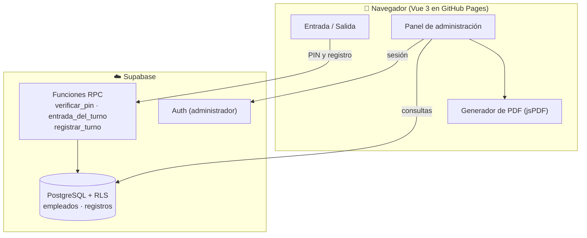

Los empleados **no leen ni escriben directamente en las tablas**: solo pueden llamar a dos funciones, que comprueban el PIN y aplican las reglas (un registro por día, la salida con la moto de la entrada, turnos de madrugada) en el servidor. El administrador se autentica con Supabase Auth y es el único con acceso a la lista de empleados.

## Estructura del proyecto

```text
.
├── .github/workflows/deploy.yml   # Compilación y publicación en GitHub Pages
├── docs/                          # Capturas y PDF de ejemplo usados en este README
├── supabase/schema.sql            # Esquema completo: tablas, políticas RLS y funciones
├── src/
│   ├── main.js                    # Arranque de la app y rutas
│   ├── App.vue
│   ├── style.css
│   ├── lib/
│   │   ├── config.js              # Motos y elementos del checklist
│   │   ├── supabase.js            # Cliente de Supabase
│   │   ├── dias.js                # Día de trabajo, fechas y comprobación de duplicados
│   │   └── pdf.js                 # Generación de la hoja mensual
│   ├── components/
│   │   ├── PinGate.vue            # Pantalla de PIN
│   │   ├── Empleados.vue          # Gestión de empleados
│   │   ├── AnadirRegistro.vue     # Alta de registros pasados
│   │   ├── EditarRegistro.vue     # Modificación de un registro
│   │   └── ConfirmarReemplazo.vue # Aviso «ya existe, ¿sustituir?»
│   └── views/
│       ├── Inicio.vue
│       ├── Entrada.vue
│       ├── Salida.vue
│       └── Admin.vue
├── .env.example                   # Variables de entorno de ejemplo
└── vite.config.js
```

## Modelo de datos

**`empleados`**

| Columna | Tipo | Descripción |
|---|---|---|
| `id` | uuid | Identificador |
| `nombre` | text | Nombre completo (se usa en la firma del PDF) |
| `pin` | text | PIN de 4 dígitos, **único** |
| `created_at` | timestamptz | Fecha de alta |

**`registros`**

| Columna | Tipo | Descripción |
|---|---|---|
| `id` | uuid | Identificador |
| `created_at` | timestamptz | Fecha y hora reales del registro (automática) |
| `dia` | date | **Día de trabajo** al que pertenece (las salidas hasta la 1:30 cuentan para el día anterior) |
| `tipo` | text | `entrada` o `salida` |
| `empleado_id` | uuid | Empleado que registra |
| `conductor` | text | Nombre del empleado en el momento del registro |
| `matricula` | text | Moto utilizada |
| `checks` | jsonb | Estado de cada elemento (`true` = Bien, `false` = Mal); solo en entradas |
| `incidencia` | text | Descripción de la incidencia, si la hay |
| `afecta_seguridad` | boolean | Si la incidencia afecta a la seguridad |
| `actuacion` | text | Actuación realizada |

Solo puede haber **un registro por empleado, tipo y día** (`empleado_id`, `tipo`, `dia`).

El esquema completo, con políticas de seguridad y funciones, está en [`supabase/schema.sql`](supabase/schema.sql).

## Puesta en marcha

Requisitos: **Node.js 18 o superior** y un proyecto gratuito de [Supabase](https://supabase.com/).

```bash
# 1. Instalar dependencias
npm install

# 2. Variables de entorno
cp .env.example .env        # y rellenar los valores (ver más abajo)

# 3. Base de datos: ejecutar supabase/schema.sql en el SQL Editor de Supabase

# 4. Arrancar en local
npm run dev
```

**Variables de entorno**

| Variable | Descripción |
|---|---|
| `VITE_SUPABASE_URL` | URL del proyecto de Supabase |
| `VITE_SUPABASE_ANON_KEY` | Clave pública (*publishable* / *anon*) |
| `VITE_ADMIN_EMAIL` | Correo del usuario administrador (en `/admin` solo se pide la contraseña) |

**Usuario administrador:** créalo en *Authentication → Users* de Supabase con ese correo y marca *Auto Confirm User*.

Otros comandos: `npm run build` (compilar a `dist/`) y `npm run preview` (probar la compilación).

## Despliegue

La publicación es automática: cada *push* a `main` ejecuta el flujo [`deploy.yml`](.github/workflows/deploy.yml), que compila la aplicación y la publica en **GitHub Pages**.

1. En *Settings → Pages*, elige **Source: GitHub Actions**.
2. Los valores públicos de Supabase se leen de `.env.production`.
3. Los QR apuntan a `https://<usuario>.github.io/<repositorio>/#/entrada` y `…/#/salida`.

Usa rutas con `#` (modo *hash*) para que funcione en GitHub Pages sin configuración adicional.

## Configuración

Edita [`src/lib/config.js`](src/lib/config.js) para cambiar:

- **`MOTOS`**: matrículas disponibles en los desplegables.
- **`ELEMENTOS`**: elementos del checklist, con su ayuda en pantalla y su etiqueta en la hoja PDF.

Los empleados y sus PIN se gestionan desde el propio panel de administración.

## Seguridad

- Los empleados solo pueden **crear o sustituir su propio registro del día a través de funciones del servidor** que validan el PIN; no tienen acceso directo a las tablas y **no pueden leer la lista de empleados ni los PIN**.
- La tabla `empleados` solo es accesible para el administrador autenticado, y solo él puede modificar o eliminar registros.
- La clave que va en el navegador es la **clave pública** de Supabase; nunca se incluye la clave `service_role` ni contraseñas en el repositorio.

Limitaciones conocidas, asumidas en esta primera versión:

- El PIN de 4 dígitos es cómodo pero **adivinable por fuerza bruta**; no hay límite de intentos.
- Los PIN se almacenan en texto plano para que el administrador pueda consultarlos.
- La lectura de registros está abierta a cualquier usuario autenticado en Supabase; conviene **desactivar el registro público de usuarios** en *Authentication → Providers → Email*.

## Hoja de ruta

Ideas para próximas versiones (no comprometidas):

- [ ] Límite de intentos de PIN y bloqueo temporal.
- [ ] Restringir la lectura de registros al correo del administrador.
- [ ] Aviso por correo cuando se registre una incidencia que afecte a la seguridad.
- [ ] Exportación de registros a CSV.
- [ ] Matrícula asignada por defecto a cada empleado.
- [ ] Historial de cambios de los registros modificados por el administrador.
